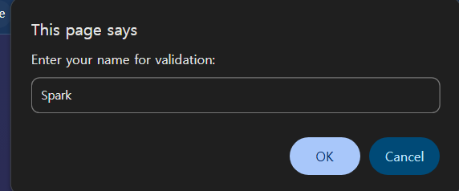
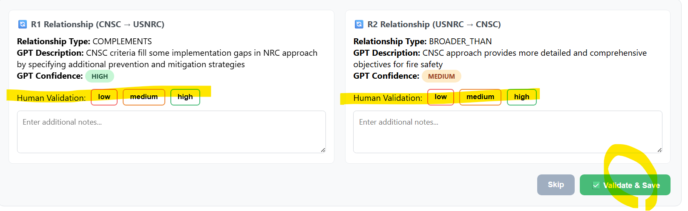

# PITA Knowledge Graph Validation UI – Usage Guide

This repository is for.. 

- UI link: 
- ß`bi-driectional_relationships_input.csv` – Input data for validation

---

## 📋 Instructions

### 1. Open the Link
- 

### 2. Enter Your Name Initials
- When prompted, enter your initials or identifier (e.g., `Spark` for Seongeun Park).
- This will be recorded in the validation results.

### 3. Upload the CSV
- Click the file input and select `bi-driectional_relationships_input.csv`.
- The UI will load the first relationship pair for review.

### 4. Review & Validate Relationships
For each relationship:
- **Read the two nodes** (CNSC and USNRC) descriptions.
- Review the **Relationship Type**, **GPT Description**, and **GPT Confidence**.
- Under **Human Validation**, select `low`, `medium`, or `high` for your assessment.
- Optionally add notes for suggested corrections.
- Click **Validate & Save** to move to the next relationship.

Repeat until you complete all **20 relationships**.

### 5. Export Results
- After completing validation, click **Export Validation Results**.
- This will download a CSV file containing your name, validation scores, and notes.

---

## 💡 Notes & Tips
- This is a **client-side only** app: your CSV is processed locally in your browser, no data is uploaded to a server.
- If you need to restart, refresh the browser and re-upload the CSV.
